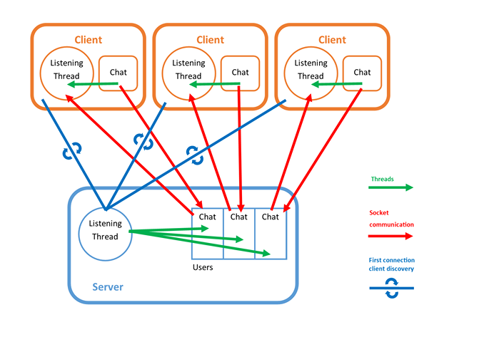

---
title:
- Chatroom Project - Network Programming
author:
- Nathan IMMACOLATO
- Louis GAILLET
- Ashan
---

# The program

The whole chatroom is one program, that acts as server when invoked without an argument, and as a client when given an argument.
We use that argument as the author name of the user for the client.

*launching in server mode:*
```
$ ./spidercat
```

*launching in client mode, with a "foo" username:
```
$ ./spidercat foo
```

# Server

## Handling several users

### Storing users

We store users in structures in an array.
Every user has an author name, a personal socket to communicate with, and an address.

### Communication with clients

The server operates on a UDP socket, which is set to **listen** on the right port for incomming connections.
As a connection is caught, we accept it and move on to a new socket.
This socket is attached to a user, and we communicate with this user via this socket.

A **thread** is started each time we catch a new user, on its dedicated socket.
This thread serves to listen to anything that a user could send our way, and process it.

Each time we recieve text, we send it to all the users, formated with the user's author name, including to the author, so he knows his message was received and relayed properly.



# Client

## Communication with the server

When a user/client starts, it tries to send a message on the right port, and waits for a reply from the server.
If the reply arrives, it means that the client has been added as a user in the server's list of users.

We then start a **thread**, to listen for anything the server might send.
In parallel, we read the user input, and send it to the server when we read a newline `'\n'`.

## Features

- Possibility to connect clients to the server (UDP)
- Possibility to use commands (exemple : /exit)
- Possibility to send and receive messages (length of max 280 characters)
- Possibility to handle up to 50 clients

# Commands

## Exit

`/exit`

An exit command, to stop the client

It stops the client, and stops the server thread associated to it.

If the server receives a totally empty message from a client, it means that client crashed.

## Help

## List users

`/lu`

Lists all users of the server.

Builds a list of all the user's author names of the users array, and sends it to the client.

## List files

## Upload a file

## Download a file

## Send a private message

## Notify on user connection

## Third person message

# Warnings

## Threads

Because of how threads work, the functions they call, on which they operate, must have a specific signature: `void *foo(void *arg*);`.
As we send information to the function on the creation of a thread, we need to cast whatever variable we send as a void pointer.

For example, when we create a thread with the information of a socket, we have to cast the `int` variable as a `void *`, and re cast it as an int inside the thread's function:

```c
void *foo(void *arg*) {
  int sockfd = (int)arg;
  [...]
}

[...]

int sockfd:
pthread_create(&thread, NULL, foo, (void *)sockfd);
```

This gives a warning, because we potentially cast variables into types that are not the same size.
We prefered to keep those, as we didn't find a solution for it that wasn't obfuscation of the issue.
